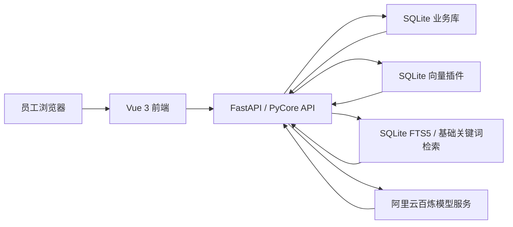
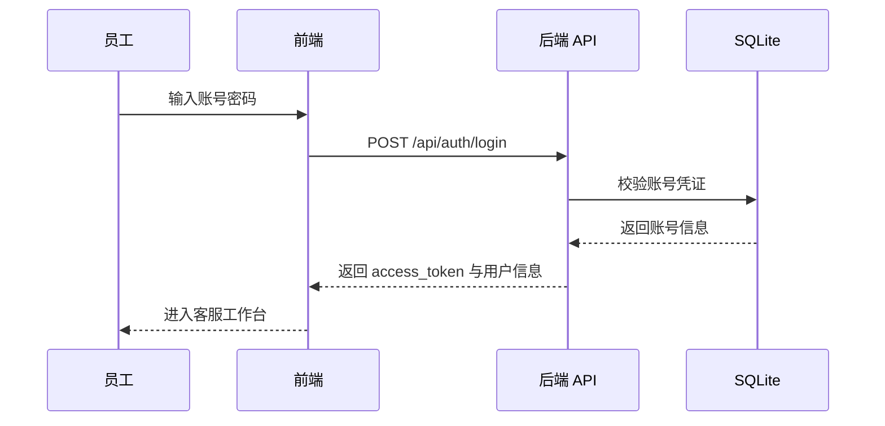
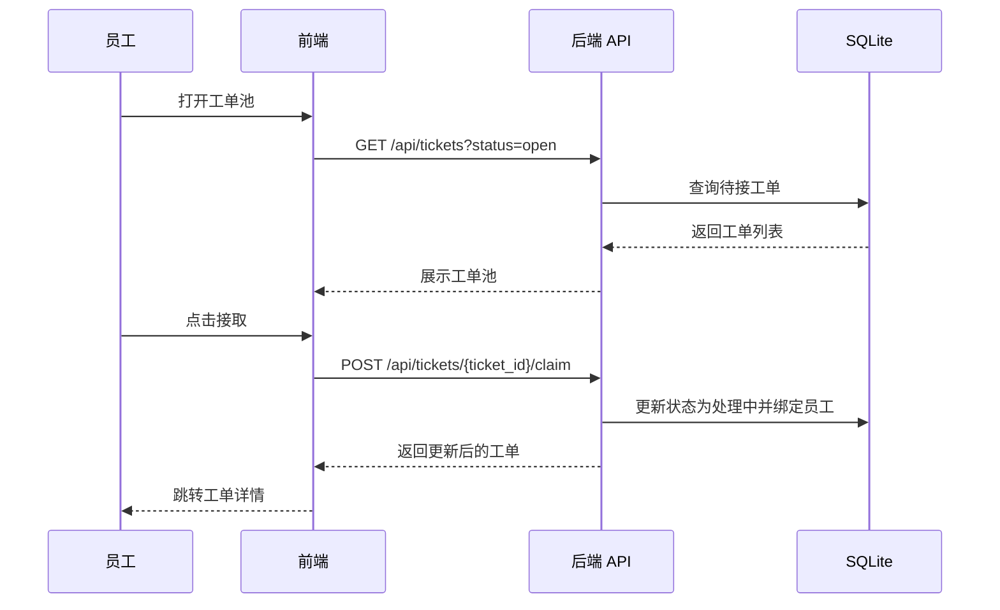
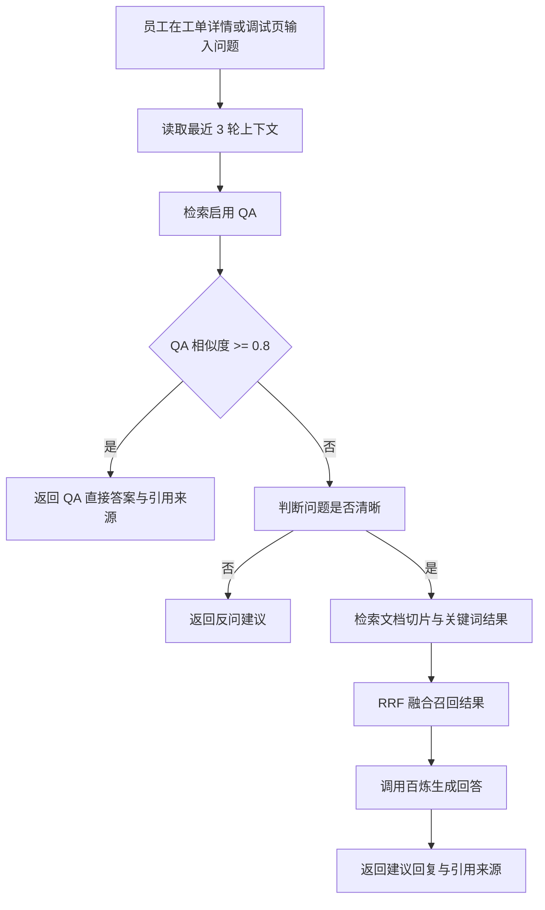
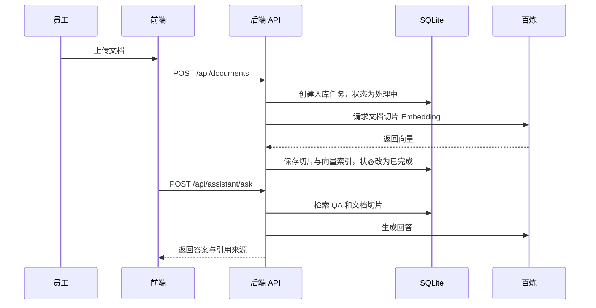

# 客服机器人 PRD

## 1. 背景与调研结论

### 1.1 项目背景

本项目建设一个客服机器人 Web 系统，MVP 阶段优先服务员工端和知识库端，让员工能够基于知识库完成客服问答、检索和工单处理，跑通第一版核心客服工作流。

### 1.2 范围边界

- 包含：员工端、知识库端、账号登录后的数据隔离、员工自行接取工单、知识库离线入库、在线检索、客服智能回答链路。
- 不包含：复杂角色隔离、客户独立前台、多租户后台、完整运营管理后台。

### 1.3 方案倾向

采用方案 C：知识库驱动的人机协作客服台。

- 页面结构以登录、客服工作台、工单池、我的工单、知识库、QA 库、文档入库、智能问答调试为主。
- 关键交互以员工接单后的 AI 检索、生成、模糊反问和人工接管为核心。
- 视觉方向采用专业 SaaS 后台：左侧导航、中央工作区、右侧 AI 辅助与知识引用面板。
- 方案选择理由：既保留客服业务闭环，又能把 QA 命中、模糊反问、记忆、RAG 检索放进真实工作台。

## 2. 页面清单与跳转逻辑

### 2.1 页面清单

| 序号 | 页面名称 | 页面类型 | 可见角色 | 入口来源 | 跳转去向 |
|---|---|---|---|---|---|
| P01 | 登录页 | 表单页 | 未登录用户 | 直接访问系统 | P02 客服工作台 |
| P02 | 客服工作台 | 工作台 / 对话页 | 已登录员工 | 登录成功、侧边栏首页 | P03、P04、P05、P07、P09 |
| P03 | 工单池 | 列表页 | 已登录员工 | 侧边栏、工作台快捷入口 | P05 工单详情 |
| P04 | 我的工单 | 列表页 | 已登录员工 | 侧边栏、工作台快捷入口 | P05 工单详情 |
| P05 | 工单详情与会话处理页 | 详情页 / 对话页 | 已登录员工 | 工单池、我的工单 | P07、P08、P09 |
| P06 | 知识库总览 | 仪表盘 / 列表页 | 已登录员工 | 侧边栏 | P07、P08 |
| P07 | QA 库管理 | 列表页 / 表单页 | 已登录员工 | 知识库总览、客服工作台、工单详情 | P06、P09 |
| P08 | 文档入库 | 表单页 / 任务页 | 已登录员工 | 知识库总览、工单详情 | P06、P09 |
| P09 | 智能问答调试 | 对话页 / 调试页 | 已登录员工 | 侧边栏、QA 库、文档入库、工单详情 | P07、P08 |
| P10 | 账号与基础设置 | 设置页 | 已登录员工 | 顶部用户菜单 | P02 |

### 2.2 页面跳转图

```text
P01 登录页
  ↓
P02 客服工作台
  ├─ P03 工单池 → P05 工单详情与会话处理页
  ├─ P04 我的工单 → P05 工单详情与会话处理页
  ├─ P06 知识库总览
  │    ├─ P07 QA 库管理
  │    └─ P08 文档入库
  ├─ P09 智能问答调试
  └─ P10 账号与基础设置
```

### 2.3 全局布局

- 登录后采用统一 SaaS 后台布局：左侧导航 + 顶部用户区 + 中央工作区。
- 左侧导航：客服工作台、工单池、我的工单、知识库总览、QA 库管理、文档入库、智能问答调试。
- 顶部用户区：当前账号、退出登录、基础设置入口。
- P05 工单详情页建议使用三栏结构：左侧工单信息，中间会话处理，右侧 AI 辅助与知识引用。

## 3. 主要功能定义与分析

### 3.1 A2 收敛原则

- MVP 只做客服机器人最小闭环：登录进入系统、接取工单、处理会话、使用知识库辅助回答、维护基础知识。
- 不做复杂报表、复杂权限、自动派单、多渠道接入、多租户、客户独立前台和运营后台。
- 每个页面只保留能支撑闭环的核心功能，后续增强统一放入 V2+。

### 页面：P01 登录页

#### 功能清单

| 功能编号 | 功能名称 | 一句话描述 | 用户可感知的完成标准 |
|---|---|---|---|
| F-01-01 | 账号密码登录 | 员工使用账号和密码进入系统 | 输入正确账号密码后进入客服工作台 |
| F-01-02 | 登录状态保持 | 员工刷新页面后保持登录状态 | 刷新后仍停留在登录后的页面 |
| F-01-03 | 退出登录 | 员工主动退出当前账号 | 点击退出后回到登录页 |

#### 功能边界

| 功能编号 | 包含 | 不包含 |
|---|---|---|
| F-01-01 | 账号、密码、错误提示 | 注册、找回密码、第三方登录 |
| F-01-02 | 本地登录态保持 | 多设备管理、强制下线 |
| F-01-03 | 清除当前登录态 | 账号注销 |

#### 与其他页面的关联

- 登录成功 → P02 客服工作台。
- 退出登录 → P01 登录页。

### 页面：P02 客服工作台

#### 功能清单

| 功能编号 | 功能名称 | 一句话描述 | 用户可感知的完成标准 |
|---|---|---|---|
| F-02-01 | 工作概览 | 展示待接、处理中、已完成等基础数量 | 员工进入首页即可看到当前工作状态 |
| F-02-02 | 待处理工单快捷区 | 展示少量需要处理的工单 | 员工可从首页直接进入工单详情 |
| F-02-03 | AI 辅助问答入口 | 提供快速提问与知识检索入口 | 员工可输入问题获得回答或追问 |
| F-02-04 | 知识库快捷入口 | 快速进入 QA 或文档入库 | 员工可从首页进入知识维护页面 |

#### 功能边界

| 功能编号 | 包含 | 不包含 |
|---|---|---|
| F-02-01 | 基础工作数量概览 | 复杂报表、趋势分析、绩效统计 |
| F-02-02 | 少量工单快捷展示 | 完整筛选、批量处理 |
| F-02-03 | 快速问答入口 | 替代完整调试台 |
| F-02-04 | 快捷跳转 | 在首页直接编辑全部知识 |

#### 与其他页面的关联

- 点击待处理工单 → P05 工单详情与会话处理页。
- 点击知识库入口 → P07 QA 库管理或 P08 文档入库。
- 点击 AI 辅助问答 → P09 智能问答调试。

### 页面：P03 工单池

#### 功能清单

| 功能编号 | 功能名称 | 一句话描述 | 用户可感知的完成标准 |
|---|---|---|---|
| F-03-01 | 待接工单列表 | 展示尚未被员工接取的工单 | 员工能看到可接取工单 |
| F-03-02 | 工单筛选搜索 | 按状态、优先级、关键词筛选工单 | 员工能快速定位目标工单 |
| F-03-03 | 接取工单 | 员工将工单接到自己名下 | 点击接取后工单进入我的工单 |
| F-03-04 | 查看工单详情 | 进入工单详情处理页面 | 点击工单后进入详情页 |

#### 功能边界

| 功能编号 | 包含 | 不包含 |
|---|---|---|
| F-03-01 | 待接工单基础信息 | 跨账号工单、已删除工单 |
| F-03-02 | 基础条件筛选 | 高级组合筛选、保存筛选器 |
| F-03-03 | 单个工单接取 | 批量接取、自动派单 |
| F-03-04 | 跳转详情 | 在列表内完整处理会话 |

#### 与其他页面的关联

- 点击接取 → 工单进入 P04 我的工单。
- 点击工单 → P05 工单详情与会话处理页。

### 页面：P04 我的工单

#### 功能清单

| 功能编号 | 功能名称 | 一句话描述 | 用户可感知的完成标准 |
|---|---|---|---|
| F-04-01 | 我的工单列表 | 展示当前员工已接取的工单 | 员工能看到自己正在处理的工单 |
| F-04-02 | 状态筛选 | 按处理中、已完成筛选 | 员工能快速区分待处理和已完成 |
| F-04-03 | 进入处理 | 打开工单详情继续处理 | 点击后进入工单详情页 |

#### 功能边界

| 功能编号 | 包含 | 不包含 |
|---|---|---|
| F-04-01 | 当前员工已接取工单 | 跨员工查看、复杂绩效统计 |
| F-04-02 | 基础状态筛选 | 高级组合筛选、保存筛选器 |
| F-04-03 | 跳转详情页处理 | 列表内批量处理 |

#### 与其他页面的关联

- 点击工单 → P05 工单详情与会话处理页。

### 页面：P05 工单详情与会话处理页

#### 功能清单

| 功能编号 | 功能名称 | 一句话描述 | 用户可感知的完成标准 |
|---|---|---|---|
| F-05-01 | 查看工单信息 | 展示问题标题、状态、优先级、来源摘要 | 员工能理解当前工单要处理什么 |
| F-05-02 | 查看会话记录 | 展示用户与客服/机器人历史对话 | 员工能看到上下文 |
| F-05-03 | AI 辅助回答 | 根据用户问题生成建议回复 | 员工能看到可复制或采用的建议答案 |
| F-05-04 | 知识引用查看 | 展示回答参考的 QA 或文档片段 | 员工能判断答案依据 |
| F-05-05 | 完成工单 | 将工单标记为已完成 | 工单从处理中进入已完成 |

#### 功能边界

| 功能编号 | 包含 | 不包含 |
|---|---|---|
| F-05-01 | 基础工单信息 | 复杂客户档案、跨系统详情 |
| F-05-02 | 当前工单会话记录 | 多渠道实时消息接入 |
| F-05-03 | 系统内建议回复 | 自动发送外部渠道消息 |
| F-05-04 | 基础知识引用 | 复杂溯源分析、知识质量评分 |
| F-05-05 | 标记完成 | 审批流、回访流 |

#### 与其他页面的关联

- 点击引用的 QA → P07 QA 库管理。
- 点击引用的文档 → P08 文档入库。
- 点击调试 → P09 智能问答调试。

### 页面：P06 知识库总览

#### 功能清单

| 功能编号 | 功能名称 | 一句话描述 | 用户可感知的完成标准 |
|---|---|---|---|
| F-06-01 | 知识库概览 | 展示 QA 数量、文档数量、最近更新时间 | 员工能知道知识库当前状态 |
| F-06-02 | QA 入口 | 跳转 QA 库管理 | 员工能进入 QA 维护 |
| F-06-03 | 文档入库入口 | 跳转文档入库 | 员工能进入资料上传或入库 |
| F-06-04 | 最近知识列表 | 展示最近新增或更新的知识 | 员工能快速查看最近维护内容 |

#### 功能边界

| 功能编号 | 包含 | 不包含 |
|---|---|---|
| F-06-01 | 基础数量和更新时间 | 复杂知识统计、趋势分析 |
| F-06-02 | 跳转 QA 管理 | 直接在总览页完整编辑 QA |
| F-06-03 | 跳转文档入库 | 直接在总览页解析文档 |
| F-06-04 | 最近知识展示 | 知识图谱、审核流 |

#### 与其他页面的关联

- 点击 QA 入口 → P07 QA 库管理。
- 点击文档入库入口 → P08 文档入库。

### 页面：P07 QA 库管理

#### 功能清单

| 功能编号 | 功能名称 | 一句话描述 | 用户可感知的完成标准 |
|---|---|---|---|
| F-07-01 | QA 列表 | 展示已有问题和答案 | 员工能浏览当前 QA |
| F-07-02 | 新增 QA | 创建一条问题答案 | 保存后列表出现新 QA |
| F-07-03 | 编辑 QA | 修改已有问题或答案 | 保存后内容更新 |
| F-07-04 | 删除 QA | 删除不再使用的 QA | 删除后列表不再显示 |
| F-07-05 | QA 搜索 | 按关键词搜索 QA | 输入关键词后列表收敛 |

#### 功能边界

| 功能编号 | 包含 | 不包含 |
|---|---|---|
| F-07-01 | QA 基础列表 | 版本历史、质量评分 |
| F-07-02 | 单条 QA 创建 | 批量导入、审核流 |
| F-07-03 | 单条 QA 修改 | 修改审批、版本回滚 |
| F-07-04 | 单条 QA 删除 | 批量删除、回收站 |
| F-07-05 | 基础关键词搜索 | 高级检索语法 |

#### 与其他页面的关联

- 返回知识库总览 → P06 知识库总览。
- 点击调试 → P09 智能问答调试。

### 页面：P08 文档入库

#### 功能清单

| 功能编号 | 功能名称 | 一句话描述 | 用户可感知的完成标准 |
|---|---|---|---|
| F-08-01 | 文档列表 | 展示已入库文档 | 员工能看到文档名称和入库状态 |
| F-08-02 | 上传文档 | 上传资料用于知识检索 | 上传后出现入库记录 |
| F-08-03 | 入库状态查看 | 查看文档是否处理完成 | 员工能看到处理中、已完成或失败 |
| F-08-04 | 删除文档 | 删除无效文档 | 删除后不再参与检索 |

#### 功能边界

| 功能编号 | 包含 | 不包含 |
|---|---|---|
| F-08-01 | 文档名称、状态、更新时间 | 复杂目录管理 |
| F-08-02 | 单个文档上传 | 批量上传、在线编辑 |
| F-08-03 | 基础入库状态 | 知识切片可视化 |
| F-08-04 | 删除文档记录 | 文档归档、回收站 |

#### 与其他页面的关联

- 返回知识库总览 → P06 知识库总览。
- 点击调试 → P09 智能问答调试。

### 页面：P09 智能问答调试

#### 功能清单

| 功能编号 | 功能名称 | 一句话描述 | 用户可感知的完成标准 |
|---|---|---|---|
| F-09-01 | 输入测试问题 | 员工输入问题验证回答效果 | 输入问题后系统返回结果 |
| F-09-02 | 查看回答结果 | 展示直接答案、反问或生成答案 | 员工能判断回答是否符合预期 |
| F-09-03 | 查看引用来源 | 展示命中的 QA 或文档片段 | 员工能看到答案依据 |
| F-09-04 | 多轮上下文测试 | 连续追问时保留最近上下文 | 员工能测试连续问答效果 |

#### 功能边界

| 功能编号 | 包含 | 不包含 |
|---|---|---|
| F-09-01 | 输入问题并发起测试 | 复杂模型参数面板 |
| F-09-02 | 直接答案、反问、生成答案 | A/B 实验 |
| F-09-03 | 基础来源展示 | 复杂溯源分析 |
| F-09-04 | 最近上下文测试 | 人工评分体系、长期评测集 |

#### 与其他页面的关联

- 从 QA 管理进入时，可用于验证 QA 命中效果。
- 从文档入库进入时，可用于验证文档检索效果。

### 页面：P10 账号与基础设置

#### 功能清单

| 功能编号 | 功能名称 | 一句话描述 | 用户可感知的完成标准 |
|---|---|---|---|
| F-10-01 | 查看账号信息 | 展示当前账号基础信息 | 员工能看到账号名 |
| F-10-02 | 退出登录 | 退出当前系统 | 点击后返回登录页 |

#### 功能边界

| 功能编号 | 包含 | 不包含 |
|---|---|---|
| F-10-01 | 当前账号名 | 组织管理、权限配置 |
| F-10-02 | 当前账号退出 | 密码修改、账号注销 |

#### 与其他页面的关联

- 退出登录 → P01 登录页。

## 4. Mission、Persona 与版本规划

### 4.1 Mission

用最小闭环做出一个可用的客服机器人系统：员工登录后能接取工单，在工单详情中查看对话、调用 AI 辅助回答，并通过 QA 库和文档入库持续维护知识来源。

### 4.2 Persona

| 用户 | 目标 | 使用场景 |
|---|---|---|
| 员工 / 坐席 | 处理工单、回复用户问题 | 登录系统、接取工单、查看会话、使用 AI 建议回复 |
| 知识维护员工 | 维护 QA 和文档资料 | 新增/编辑 QA，上传文档，测试问答效果 |

第一版不区分复杂角色，登录员工都能看到 MVP 页面，但只能看到当前账号相关数据。

### 4.3 V1 / MVP

| 页面 | 包含功能 | 排除功能 | 理由 |
|---|---|---|---|
| P01 登录页 | 账号密码登录、登录保持、退出 | 注册、找回密码、第三方登录 | 先保证员工可进入系统 |
| P02 客服工作台 | 基础工作概览、待处理工单、AI 快捷问答、知识入口 | 复杂报表、趋势分析 | 首页只做进入闭环的入口 |
| P03 工单池 | 待接工单、基础筛选、接取、查看详情 | 批量接取、自动派单 | 先支持人工接单 |
| P04 我的工单 | 我的工单列表、状态筛选、进入处理 | 绩效统计、跨员工查看 | 先保证员工跟进自己的工单 |
| P05 工单详情 | 工单信息、会话记录、AI 辅助回答、知识引用、完成工单 | 多渠道实时消息、审批流 | 核心客服处理闭环 |
| P06 知识库总览 | QA/文档数量、入口、最近知识 | 知识统计、知识图谱 | 只做知识管理入口 |
| P07 QA 库管理 | QA 增删改查、搜索 | 审核流、批量导入导出 | 先维护基础问答库 |
| P08 文档入库 | 文档列表、上传、状态查看、删除 | 在线编辑、切片可视化 | 先让资料参与检索 |
| P09 智能问答调试 | 输入问题、查看回答、查看引用、多轮上下文测试 | 参数面板、A/B 实验、评分体系 | 验证知识库和回答效果 |
| P10 账号设置 | 查看账号、退出 | 权限配置、密码修改 | 只保留基础账号能力 |

### 4.4 V2+

| 功能 | 预计版本 | 延后理由 |
|---|---|---|
| 自动派单 | V2 | 需要规则和调度策略，非 MVP 必需 |
| 多角色权限 | V2 | 第一版不做复杂组织权限 |
| 批量导入导出 QA | V2 | 提高运营效率，但不影响最小闭环 |
| 文档切片可视化 | V2 | 增加设计和实现成本 |
| 多渠道消息接入 | V2 | 依赖外部平台和回调配置 |
| 复杂统计报表 | V2 | 不影响接单、回答、知识维护闭环 |
| 人工评分与评测集 | V2 | 适合问答质量优化阶段 |

### 4.5 关键业务规则

- 账号数据隔离：员工只能看到当前账号相关数据。
- 工单流转：待接取 → 处理中 → 已完成。
- 工单接取：员工从工单池手动接取，接取后进入我的工单。
- QA 命中：问题能匹配已有 QA 时优先返回 QA 答案。
- 模糊问题：问题不清楚时，系统应反问，而不是强行回答。
- 知识引用：AI 回答需要展示参考来源，便于员工判断可信度。
- 最小闭环优先：任何不影响“登录 → 接单 → AI 辅助回答 → 知识维护 → 调试验证”的能力，都默认延后。

## 5. 复杂功能业务链路与关键实现思路

### 5.1 工单流转链路

适用页面：P03 工单池、P04 我的工单、P05 工单详情与会话处理页。

```text
待接取 → 员工接取 → 处理中 → 员工处理会话 → 标记完成 → 已完成
```

- 工单初始进入工单池，状态为待接取。
- 员工点击“接取”后，工单进入该员工的我的工单。
- 员工在工单详情里查看历史会话，并使用 AI 辅助回答。
- 员工确认处理完成后，手动标记为已完成。
- MVP 不做自动派单、审批、回访、多员工协作。

### 5.2 QA 优先命中链路

适用页面：P05 工单详情与会话处理页、P09 智能问答调试、P07 QA 库管理。

```text
用户问题 → 检索 QA 库 → 判断相似度 → 命中则直接返回 QA 答案
```

- 系统优先查 QA 库。
- 相似度阈值沿用文章设定：0.8。
- 命中结果应展示来源 QA，方便员工判断是否可用。
- MVP 不做复杂阈值配置页面。

### 5.3 模糊问题反问链路

适用页面：P05 工单详情与会话处理页、P09 智能问答调试。

```text
QA 未命中 → 判断意图是否清晰 → 不清晰 → 生成反问 → 等待用户补充
```

- 当问题缺少必要信息时，系统不强行生成完整答案。
- 系统返回一条反问，引导用户补充具体问题。
- 员工能看到这是一条“反问建议”，再决定是否采用。
- MVP 不做多层复杂槽位表单，只做自然语言反问。

### 5.4 知识库检索生成链路

适用页面：P05 工单详情与会话处理页、P08 文档入库、P09 智能问答调试。

```text
问题明确但 QA 未命中
→ 结合最近上下文改写问题
→ 检索文档知识
→ 生成回答
→ 展示引用来源
```

- 文档入库后的内容参与检索。
- 回答必须尽量基于知识库内容。
- 回答结果需要展示引用来源。
- MVP 只要求能完成“资料入库 → 问题检索 → 生成回答 → 展示来源”的闭环。
- MVP 不做知识切片可视化、复杂重排调参和评测集。

### 5.5 上下文与记忆链路

适用页面：P05 工单详情与会话处理页、P09 智能问答调试。

```text
当前问题 + 最近 3 轮对话 → 辅助理解当前问题
```

- 短期上下文固定保留最近 3 轮。
- 长期记忆 MVP 先做字段预留或基础用户信息，不做复杂画像系统。
- 员工侧不需要单独配置记忆规则。

### 5.6 文档入库链路

适用页面：P08 文档入库、P06 知识库总览、P09 智能问答调试。

```text
上传文档 → 显示处理中 → 入库完成/失败 → 参与智能问答检索
```

- 员工上传文档后能看到入库状态。
- 入库完成后，文档能作为智能回答来源。
- 入库失败时需要给出失败状态。
- MVP 不做文档在线编辑、复杂目录、切片可视化。

### 5.7 A4 确认记录

- QA 直接命中阈值：0.8。
- 短期上下文：最近 3 轮。
- 长期记忆：MVP 先做字段预留或基础用户信息，不做复杂画像。

### 5.8 数据库、向量检索与模型服务选型

#### 业务数据库

- V1 使用 SQLite 作为唯一业务数据库。
- SQLite 存储账号、工单、会话消息、QA 知识、文档元数据、基础用户记忆。
- 后端访问方式使用 SQLAlchemy Async + aiosqlite，并基于 PyCore 数据库模板扩展。
- V1 不引入 PostgreSQL、MySQL、MongoDB 等其他业务数据库。

#### 向量存储

- V1 使用 SQLite 向量插件实现本地向量检索，不引入 ChromaDB、Milvus、Elasticsearch、pgvector 等独立向量数据库或搜索服务。
- 向量数据与业务数据同属 SQLite 体系，文档切片、QA 向量索引、向量维度、来源类型、来源 ID 等信息需要在 SQLite 中可追踪。
- 关键词检索优先使用 SQLite FTS5；如开发环境插件受限，可先降级为基础 LIKE 检索，但必须在开发计划中标注为降级能力。
- 混合检索采用向量 TopK + 关键词 TopK + RRF 融合。
- V1 不接入单独 Rerank 服务，避免超出最小闭环。

#### 模型服务

- 所有模型服务统一使用阿里云百炼，不接入 OpenAI、Claude、Kimi、DeepSeek 等其他模型服务。
- Embedding 默认使用百炼 `text-embedding-v4`，默认向量维度 1024。
- 智能回答、意图判断、模糊反问、问题改写默认使用百炼通用文本生成模型，默认模型为 `qwen-plus`。
- 调用百炼时遵守后端开发规则：禁止使用官方 SDK，必须通过 `httpx` 直接调用 HTTP / OpenAI 兼容接口，且 HTTP 客户端必须显式 `trust_env=False`。
- 百炼 API Key 只能写入后端 `.env` 等配置文件，PRD、Plan、任务文件和测试报告中只记录字段名与配置状态，不记录真实密钥。

## 6. 数据契约确认清单

### 6.1 业务数据契约

#### 账号

- [x] 账号字段：账号 ID、账号名、登录名、密码凭证、创建时间
- [x] 第一版不做角色字段区分复杂权限
- [x] 数据可见性：员工只能看到当前账号相关数据

#### 工单

- [x] 工单字段：工单 ID、标题、问题描述、状态、优先级、创建时间、接取员工、完成时间
- [x] 工单状态：待接取 → 处理中 → 已完成
- [x] 优先级：低 / 中 / 高
- [x] MVP 不做自动派单字段

#### 会话消息

- [x] 消息字段：消息 ID、工单 ID、发送方、内容、创建时间
- [x] 发送方：用户 / 员工 / 机器人
- [x] 会话记录按时间顺序展示

#### QA 知识

- [x] QA 字段：QA ID、问题、答案、启用状态、创建时间、更新时间
- [x] QA 启用状态：启用 / 停用
- [x] QA 直接命中阈值：0.8

#### 文档知识

- [x] 文档字段：文档 ID、文档名称、入库状态、上传时间、更新时间
- [x] 入库状态：处理中 / 已完成 / 失败
- [x] 已完成文档参与智能问答检索

#### 文档切片与向量索引

- [x] 文档切片字段：切片 ID、文档 ID、切片内容、切片序号、创建时间
- [x] 向量索引字段：向量 ID、来源类型、来源 ID、向量维度、Embedding 模型名、创建时间
- [x] 来源类型：QA / 文档切片
- [x] 向量存储：SQLite 向量插件
- [x] Embedding 模型：百炼 `text-embedding-v4`
- [x] 默认向量维度：1024

#### AI 回答结果

- [x] 回答类型：QA 直接答案 / 反问 / 知识库生成答案
- [x] 回答内容：展示给员工的建议回复
- [x] 引用来源：来源类型、来源标题、来源片段
- [x] 来源类型：QA / 文档
- [x] 模糊问题必须返回反问，不强行生成答案

#### 上下文与记忆

- [x] 短期上下文：最近 3 轮对话
- [x] 长期记忆：MVP 只做基础字段预留或基础用户信息，不做复杂画像

#### 模型服务配置

- [x] 模型服务提供方：阿里云百炼
- [x] 文本生成默认模型：`qwen-plus`
- [x] Embedding 默认模型：`text-embedding-v4`
- [x] 百炼 API Key 配置字段：`DASHSCOPE_API_KEY`
- [x] 百炼 Base URL 配置字段：`BAILIAN_BASE_URL`
- [x] 真实密钥只允许写入 `.env` 等本地配置文件

### 6.2 统一接口响应契约

#### 成功响应

- [x] 格式：`{"code": 200, "message": "success", "data": {...}}`

#### 错误响应

- [x] 格式：`{"code": <错误码>, "message": "<错误描述>", "data": null}`

#### 分页响应

- [x] 格式：`{"code": 200, "message": "success", "data": {"items": [...], "total": 100, "page": 1, "page_size": 20}}`

#### HTTP 状态码

- [x] `200`：成功
- [x] `400`：参数错误
- [x] `401`：未认证
- [x] `403`：无权限
- [x] `404`：资源不存在
- [x] `500`：服务器内部错误

### 6.3 A5 确认记录

- 用户已确认业务数据契约。
- 用户已确认统一接口响应契约。

## 7. 路线图终版

### 7.1 MVP 交付目标

MVP 只交付一个可运行的客服机器人最小闭环：

```text
员工登录 → 查看工作台 → 从工单池接单 → 在工单详情处理会话
→ 使用 AI 建议回复与知识引用 → 完成工单
→ 维护 QA / 上传文档 → 在智能问答调试页验证效果
```

### 7.2 MVP 功能范围

| 模块 | MVP 必做 | 明确不做 |
|---|---|---|
| 账号登录 | 账号密码登录、登录态保持、退出登录 | 注册、找回密码、第三方登录、多角色权限 |
| 工单处理 | 工单池、我的工单、接取工单、完成工单 | 自动派单、批量处理、审批流、回访流 |
| 会话处理 | 查看会话记录、员工编辑回复、采用 AI 建议 | 多渠道实时接入、外部消息自动发送 |
| AI 辅助 | QA 优先命中、模糊反问、知识库生成答案、引用来源 | 模型参数面板、A/B 实验、人工评分体系 |
| 知识库 | QA 增删改查、文档上传、入库状态、基础检索 | QA 批量导入导出、知识审核流、切片可视化 |
| 设置 | 当前账号信息、退出登录 | 组织管理、权限配置、密码修改 |

### 7.3 V2+ 方向

| 方向 | 内容 | 前置条件 |
|---|---|---|
| 自动派单 | 根据优先级、工单类型、员工负载分配工单 | MVP 工单流转稳定 |
| 多角色权限 | 管理员、坐席、知识维护等角色隔离 | 用户组织结构明确 |
| 多渠道接入 | 接入网页、IM 或第三方客服渠道 | 外部平台回调和消息规范明确 |
| 知识运营增强 | 批量导入导出、审核流、质量评分 | QA 与文档维护频率提升 |
| 问答质量评测 | 人工评分、评测集、效果看板 | 问答样本和运营指标积累 |

## 8. 技术架构蓝图

### 8.1 总体架构



### 8.2 前端架构

- 技术栈：Vue 3、TypeScript、Vite、Vue Router、Pinia、Tailwind CSS。
- UI 来源：以 `docs/prototypes/NN-页面名/index.html` 为视觉参考，不引入重型后台模板。
- 数据访问：前端服务层统一封装 API 调用；开发初期使用 `frontend/src/mocks/`，字段严格对齐 `docs/api-contracts.md`。
- 登录态：MVP 使用本地 token 保存当前登录态，并在请求头中携带。
- 页面结构：登录页独立布局；登录后页面共用左侧导航、顶部用户区、内容区。

### 8.3 后端架构

- 技术栈：Python 3.11+、FastAPI、PyCore。
- API 层：负责鉴权、参数校验、统一响应、错误处理。
- Service 层：封装工单、会话、知识库、问答编排等业务逻辑。
- Repository 层：封装 SQLite 数据读写，避免业务逻辑直接拼接 SQL。
- AI Gateway：统一封装百炼调用，使用 `httpx.AsyncClient(trust_env=False)`。
- 数据初始化：MVP 提供本地 SQLite schema 初始化与少量演示数据，便于前后端联调。

### 8.4 数据与检索架构

- 业务数据：账号、工单、会话、QA、文档、文档切片、基础记忆统一存储在 SQLite。
- 向量检索：使用 SQLite 向量插件保存 QA 与文档切片向量。
- 关键词检索：优先使用 SQLite FTS5；若本地环境缺少 FTS5 能力，降级为 LIKE 检索并在测试报告中标注。
- 混合召回：向量 TopK 与关键词 TopK 结果做 RRF 融合，返回给问答编排链路。
- Embedding：统一使用百炼 `text-embedding-v4`，默认维度 1024。

### 8.5 部署方案

- MVP 面向本地开发与单机演示部署。
- 前端通过 Vite 构建静态资源。
- 后端通过 FastAPI 服务对外提供 `/api/**` 接口。
- SQLite 数据文件、上传文件、日志文件保存在项目运行目录下的本地数据目录。
- 生产化部署、容器编排、多副本和云存储属于 V2+，不进入 MVP。

## 9. 原型说明

### 9.1 原型文件位置

原型统一位于 `docs/prototypes/`，每个页面目录包含：

- `index.html`：Stitch 导出的页面源码，作为前端实现参考。
- `screen.png`：页面预览图，作为视觉验收参考。

### 9.2 页面与原型对应关系

| 页面编号 | 页面名称 | 原型目录 |
|---|---|---|
| P01 | 登录页 | `docs/prototypes/01-登录页/` |
| P02 | 客服工作台 | `docs/prototypes/02-客服工作台/` |
| P03 | 工单池 | `docs/prototypes/03-工单池/` |
| P04 | 我的工单 | `docs/prototypes/04-我的工单/` |
| P05 | 工单详情与会话处理页 | `docs/prototypes/05-工单详情/` |
| P06 | 知识库总览 | `docs/prototypes/06-知识库总览/` |
| P07 | QA 库管理 | `docs/prototypes/07-QA库管理/` |
| P08 | 文档入库 | `docs/prototypes/08-文档入库/` |
| P09 | 智能问答调试 | `docs/prototypes/09-智能问答调试/` |
| P10 | 账号与基础设置 | `docs/prototypes/10-账号与基础设置/` |

### 9.3 原型实现约束

- 前端实现应尽量复用原型中的布局密度、配色、字号层级和三栏工作区结构。
- P05 工单详情只保留采用建议、查看引用、完成工单等 MVP 动作。
- P09 智能问答调试只展示回答结果、反问、引用来源和基础上下文，不展示模型版本、请求号、原始上下文或内部链路。
- 页面交互以完成业务闭环为准，不新增复杂报表、复杂权限和运营后台能力。

## 10. 核心流程图

### 10.1 登录与工作台进入流程



### 10.2 工单接取与处理流程



### 10.3 AI 辅助回答流程



### 10.4 文档入库与调试流程



## 11. 组件交互说明

### 11.1 前端组件关系

| 组件 | 使用页面 | 作用 |
|---|---|---|
| 登录表单 | P01 | 收集账号密码并进入系统 |
| 应用布局 | P02-P10 | 左侧导航、顶部账号区、内容区容器 |
| 工单列表 | P02、P03、P04 | 展示工单摘要、状态、优先级和入口 |
| 工单详情面板 | P05 | 展示工单基础信息、客户问题、处理状态 |
| 会话面板 | P05、P09 | 展示消息气泡与输入框 |
| AI 建议面板 | P02、P05、P09 | 展示建议回复、反问和引用来源 |
| QA 表格与表单 | P07 | 支持 QA 新增、编辑、删除、搜索 |
| 文档入库表格 | P08 | 支持上传、状态查看、删除 |
| 账号设置面板 | P10 | 展示当前账号并支持退出 |

### 11.2 后端模块关系

| 模块 | 主要职责 | 依赖 |
|---|---|---|
| Auth | 登录、当前用户、退出登录 | SQLite 账号表 |
| Tickets | 工单池、我的工单、接取、完成 | 工单表、会话消息表 |
| Conversations | 会话消息读取与新增 | 工单表、消息表 |
| Knowledge QA | QA 增删改查、启停、搜索 | QA 表、向量索引 |
| Documents | 文档上传、入库状态、删除 | 文档表、切片表、向量索引 |
| Assistant | QA 命中、反问、文档检索生成 | QA、Documents、百炼 |
| Settings | 当前账号信息 | Auth |

### 11.3 调用关系

- 登录页调用 Auth，成功后写入前端登录态。
- 工单池调用 Tickets 查询待接工单，接取后跳转工单详情。
- 工单详情调用 Conversations 获取会话，并调用 Assistant 获取建议回复。
- AI 建议面板展示 Assistant 返回的 `answer_type`、`answer` 和 `references`。
- QA 管理新增或编辑后，需要同步生成或更新对应向量。
- 文档入库完成后，文档切片和向量参与 Assistant 检索。

## 12. 技术选型与风险

### 12.1 关键技术选型

| 领域 | 选型 | 理由 |
|---|---|---|
| 前端框架 | Vue 3 + TypeScript + Vite | 与项目全局技术栈一致，适合快速实现 SaaS 后台 |
| 前端样式 | Tailwind CSS | 原型导出为 Tailwind 风格，便于保持视觉一致 |
| 前端状态 | Pinia | 仅管理登录用户、筛选条件和少量页面状态 |
| 后端框架 | FastAPI + PyCore | 与项目全局技术栈一致，便于按 API / Service / Repository 分层 |
| 业务数据库 | SQLite | 单机 MVP 成本低，满足账号、工单、知识库数据存储 |
| 向量检索 | SQLite 向量插件 | 遵守“不引入其他数据库”的约束 |
| 关键词检索 | SQLite FTS5，必要时 LIKE 降级 | 支撑最小闭环的混合召回 |
| 模型服务 | 阿里云百炼 | 用户已明确所有模型服务统一使用百炼 |
| HTTP 客户端 | httpx AsyncClient | 直接调用百炼 HTTP / OpenAI 兼容接口，显式 `trust_env=False` |

### 12.2 风险与缓解

| 风险 | 影响 | 缓解方案 |
|---|---|---|
| SQLite 向量插件在本机安装或兼容性受限 | 文档与 QA 向量检索无法完整验证 | 先实现插件适配层；若插件不可用，开发阶段以关键词检索降级跑通闭环，并在测试报告标注 |
| 百炼额度、网络或 Key 配置不可用 | AI 回答、Embedding、反问链路无法真实联调 | 外部服务权限在 Plan 中列为开发前确认项；缺失时只允许 Mock/fallback 验收 |
| 文档解析格式复杂 | 文档入库失败率升高 | MVP 优先支持纯文本、Markdown、简单 PDF 文本抽取；复杂格式进入 V2+ |
| QA 阈值固定为 0.8 可能不适配所有问题 | 直接命中或反问效果不稳定 | MVP 固定阈值，调试页用于人工验证；阈值配置与评测进入 V2+ |
| 前端原型与真实数据长度差异 | 页面可能出现拥挤或换行异常 | 前端开发时使用 api-contracts.md 中的长文本样例验收 |
| 单机 SQLite 并发能力有限 | 多员工高并发场景受限 | MVP 面向单机演示和小规模使用；高并发部署进入 V2+ |

### 12.3 安全与配置约束

- 真实 `DASHSCOPE_API_KEY`、token、密码等敏感值只允许写入 `.env` 或 `.env.local`。
- 文档、计划、任务文件和测试报告只记录配置字段名，不记录真实值。
- 后端调用外部模型服务时禁止继承系统代理环境，必须显式设置 `trust_env=False`。
- MVP 不记录员工输入的敏感外部凭证；上传文件仅用于本地演示和知识检索。
